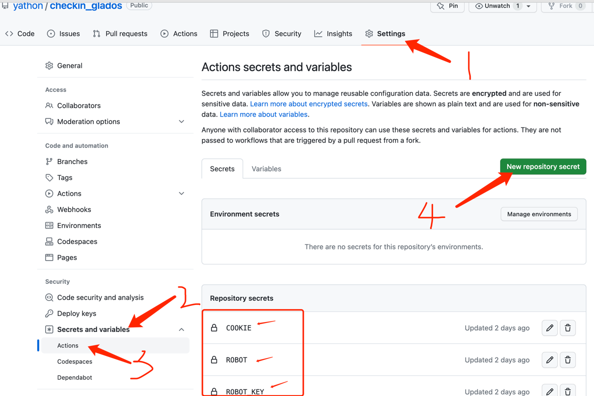

# checkin_glados

Automatically check in on a daily schedule.

## 参数说明

- COOKIES: 登录后的cookie列表，以 COOKIE_SPLIT 分隔，cookie不会找的上网搜索教程。
- COOKIE_SPLIT: cookie列表分隔字符串，不能和cookie中的内容重复。
- WAIT: 账号签到的时间间隔秒数，可选，5-3600之间。
- ROBOT: 通知机器人的token，钉钉和企业微信都可以，自动识别。
- ROBOT_KEY: 钉钉机器人需要关键字才能发送，企业微信可以留空，但是必须设置该字段。

设置仓库的环境变量如下图（仅参考步骤即可，图中参数未同步变更）：

